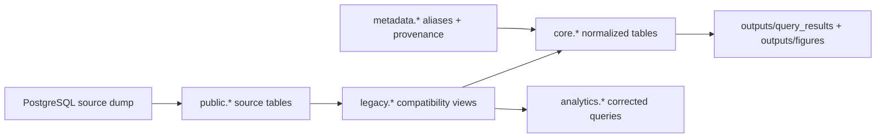

# Architecture

## Design Goals

- maintain source tables and modern analytical schema in parallel
- isolate normalization work from imported source artifacts
- allow analysis without requiring ArcGIS Pro
- expose a clear path from source data import to normalized analytical outputs

## Practical Data Strategy

The database import lands in `public.*` to preserve the original object names. The modernization layer adds `legacy.*` compatibility views rather than rewriting source tables in place.

## Schemas

- `public`: import target for source tables
- `legacy`: read-only compatibility views over `public`
- `metadata`: source datasets and alias tables
- `core`: normalized relational and spatial tables
- `analytics`: views and reusable analytical logic

## Separation of Responsibilities

- Source tables are treated as immutable reference data.
- Modern constraints, foreign keys, and normalized names are applied only in `core`.
- Query corrections and new analyses live in `analytics`.
- Generated outputs live under `outputs/`.
